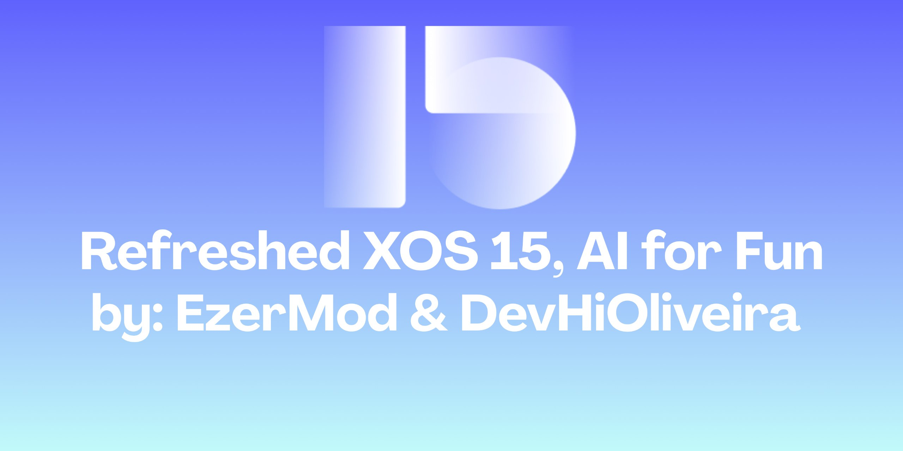
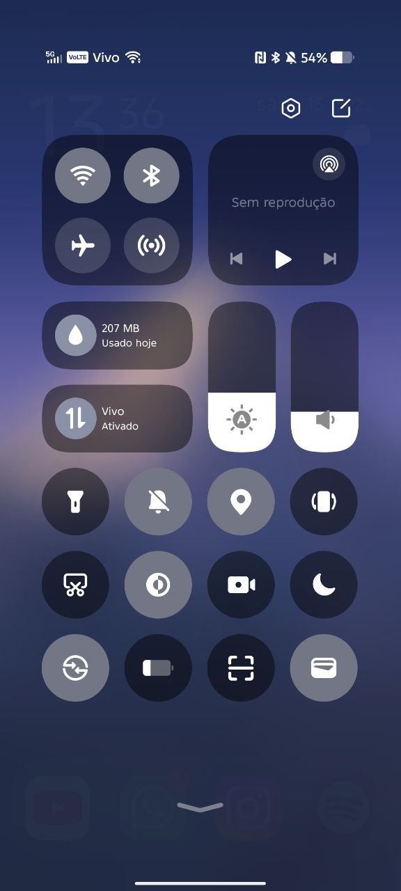
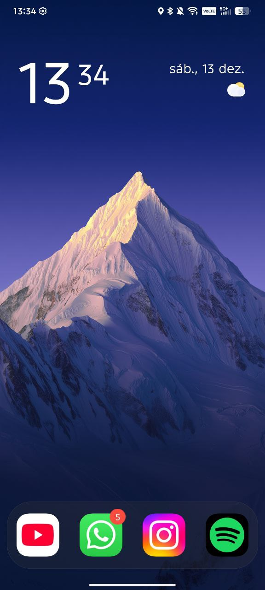
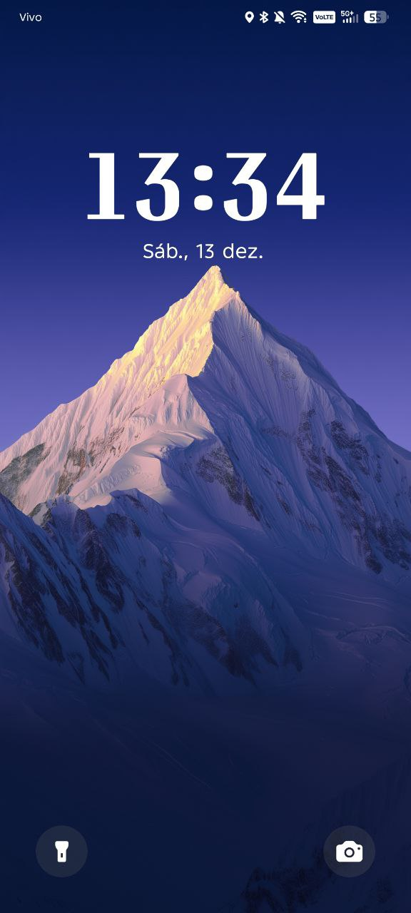
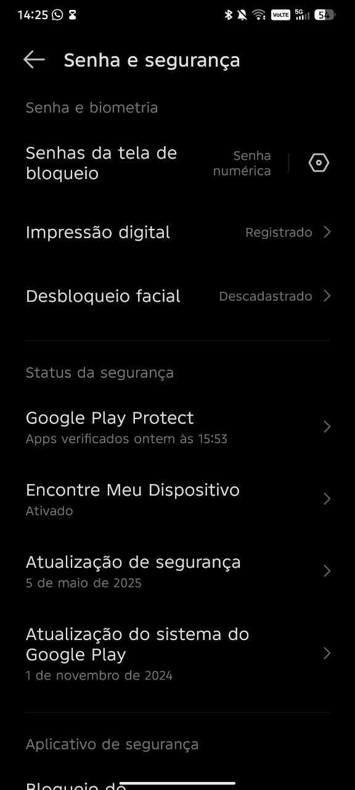
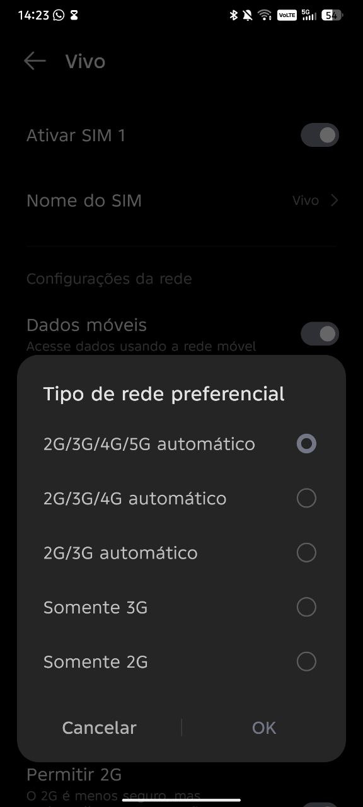
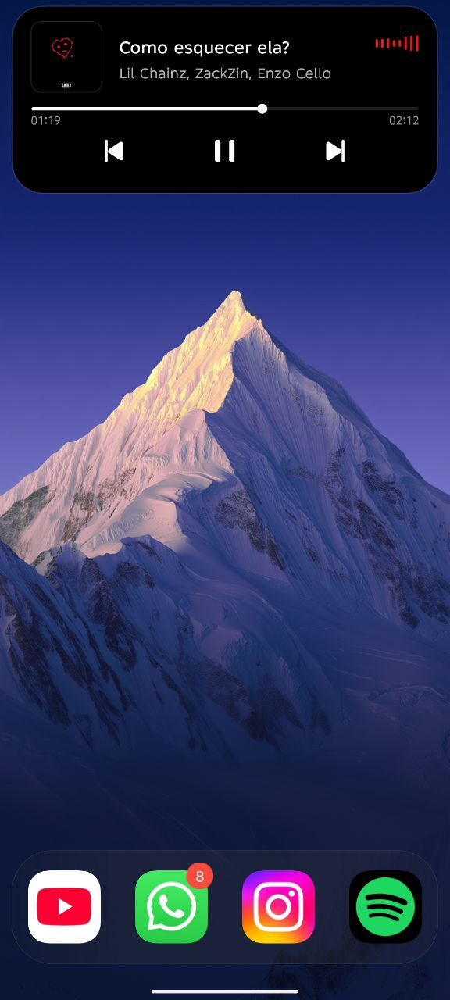
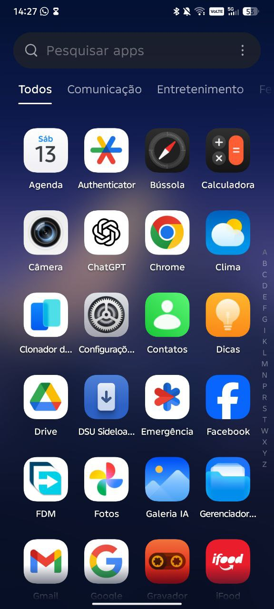

<h1 align="center">📱 XOS 15.0.3.127 Stable – Moto G54 5G - Moto G64 5G</h1>

<p align="center">
  
</p>

<p align="center">
  <b>Firmware Required:</b> V1TDS35H.83-20-5-6<br>
  <b>Version:</b> 15.0.3.127 EU Stable<br>
  <b>Base Device:</b> Infinix Note 40 5G<br>
</p>

---

## ✨ Features & Improvements

<details>
<summary><b>Click to expand</b></summary>

### ✔ What’s Working
- Fingerprint sensor
- Bluetooth
- Wi-Fi
- SIM card (calls and mobile data)
- Mobile hotspot
- Display brightness control
- Audio (speaker and microphone)<br>
<b>In short: all core features are fully functional.</b>

### 🚀 Enhancements
- Removed AOD (not needed for IPS panels)
- Added Transsion Flagship (XOS) – credit: @nyello08
- Flagship Animations Enabled – credit: @nyello08
- Preferred Network 4G/5G Enabled – credit: @devhioliveira10 made the changes, and @Not_psyco discovered the solution and helped
- Lockscreen Wallpaper Fixed – credit: @devhioliveira10
- Included OrangeFox (OFOX) – credit: @ussr_1674 (Soviet)
- Removed HBM mode (not needed for IPS panels) - credit: @devhioliveira10
- removed sar support to improve wifi performance – credit: @devhioliveira10

## ✨ Features

- 🧩 System experience preserved as close as possible to the original XOS  
- 🎮 Game Mode with Turbo Mode fully integrated  
- 📦 Extras folder including useful modules and applications  
- 📊 Dynamic Bar support  
- 📷 2K camera recording support
- ✅ Play Integrity fix  
- 🧩 Pixel & property spoofing  
- ⚙️ Per-app spoofing manager  
- ☁️ Google Photos unlimited backup  
- 🧰 Payload dumper integration  
- 🎮 Unlock high-FPS modes in games  
- 🧾 Modify application data files safely  

- 🤖 **Infinix AI Features**
  - **Folax Smart Touch**
  - **Call Assistant** – real-time AI translation, automatic call summaries, and AI call answering
  - **Social Assistant** – two-way translation and call summaries for social scenarios
  - **Writing Assistant** – rewrite text, fix spelling and grammar, generate summaries, and perform research
  - **Recording Summary** – transcribe recordings into text and generate summaries
  - **AI Visual Enhancer** – intelligently enhances low-resolution videos for a clearer viewing experience

- ⚡ Highly optimized system with excellent performance and stability

</details>

---

## 🐞 Known Bugs
- DT2W / R2W / ST2W *(Moto side)*

---

## 📖 Notes

<details>
  <summary><b>Click to expand</b></summary>

- Always back up your data before flashing. If something goes wrong, it’s better to lose time than lose data — corporate wisdom.

- Some useful applications are available in the Extras folder.

- The default Infinix camera is available in the Extras folder on Google Drive.
Both HIOS/XOS stock cameras have lower image quality and are unable to record at 60 FPS due to compatibility limitations.
For the best possible quality and proper 60 FPS recording, it is recommended to use GCam.

- Google Play Store comes **preinstalled by default**.

- To ensure the **integrity system works properly**, please download **KaoriosToolbox.apk** from the **Extras** folder on Google Drive.  
  With Kaorios Toolbox, you can customize several system options — explore at your own risk (and enjoyment).

</details>

---

## ⏳ Changelogs

<details>
  <summary><b>Click to expand</b></summary>

### 📱 XOS v15 | PORT  
**Moto G54 5G / Moto G64 5G**  
**Last Updated:** 05/01/2026  

---

## 🇧🇷 PT-BR — Changelog (Nova Atualização)

### 🔧 Instalação
- A XOS agora pode ser instalada diretamente pelo **recovery** ou via **ADB sideload**.  
- O método via recovery/ADB sideload é o **recomendado**, pois utiliza um processo mais seguro, evitando problemas recorrentes em vários Moto G54, como:
  - Falha de boot  
  - Falta de espaço para flash da partição `system_ext`

### 🧹 Apps e Modularização
- Diversos aplicativos foram removidos do sistema base e tornados **opcionais**.  
- O pacote de download inclui:
  - ZIP principal da **XOS Port**
  - Pasta **Extras**, contendo:
    - Aplicativos originais da Infinix  
    - Apps úteis  
    - Módulos adicionais  

### 🧱 Base do Sistema
- A versão base da XOS não foi atualizada devido à **instabilidade das versões mais recentes**.  
- A base atual foi mantida, porém com:
  - Aplicativos atualizados  
  - Recursos e ajustes internos revisados  

### 🚀 Estabilidade e Recursos
- Sistema mais estável e com mais recursos.  
- Melhorias aplicadas em:
  - Animações do sistema  
  - Dynamic Bar  
  - Página de Configurações  
  - Wi-Fi  
  - Bateria  
  - NFC  

### 🔐 Segurança e Root
- **Strong Integrity** passando por padrão.  
- **KernelSU Next** incluído por padrão.

### 🧰 Extras
- **KaoriosToolBox** adicionado.  
  - Para habilitar benefícios como FPS desbloqueado, Strong Integrity e Google Fotos ilimitado, instale o APK presente na pasta **Extras**.  
  - Para utilizar o contador de FPS e recursos avançados, é necessário conceder **permissão de Superusuário**.

---

## 🇺🇸 English — Changelog (New Update)

### 🔧 Installation
- XOS can now be flashed directly via **recovery** or **ADB sideload**.  
- The recovery/ADB sideload method is **recommended**, as it provides a safer installation process and prevents common issues reported on several Moto G54 devices, such as:
  - Boot failures  
  - Insufficient space to flash the `system_ext` partition  

### 🧹 Apps and Modularity
- Many applications were removed from the base system and made **optional**.  
- The download package includes:
  - Main **XOS Port ZIP**
  - **Extras** folder containing:
    - Original Infinix applications  
    - Useful apps  
    - Additional modules  

### 🧱 System Base
- The XOS base version was not updated due to **stability issues in newer releases**.  
- The current base was kept, but with:
  - Updated applications  
  - Revised features and internal improvements  

### 🚀 Stability and Features
- The system is now more stable and includes additional features.  
- Improvements were made to:
  - System animations  
  - Dynamic Bar  
  - Settings page  
  - Wi-Fi  
  - Battery  
  - NFC  

### 🔐 Security and Root
- **Strong Integrity** passes by default.  
- **KernelSU Next** is included by default.

### 🧰 Extras
- **KaoriosToolBox** has been added.  
  - To enable features such as Unlocked FPS, Strong Integrity, and Unlimited Google Photos, install the APK available in the **Extras** folder.  
  - Superuser permission is required to use the FPS overlay and advanced features.

</details>

---

## 📥 Installation Guide

<details>
<summary><b>Port Flashing</b></summary>

### Method 1: Recovery Installation (Recommended)

If you choose the recovery method, the process is straightforward:

1. Boot your device into **recovery mode**.
2. Perform a **Format Data** to ensure a clean installation.
3. Reboot back into **recovery mode** again.
4. Copy the **XOS ZIP** to your internal storage.
5. Go to **Install**, select the ZIP file, and **swipe to confirm** the flash.

If you are unable to copy the file to internal storage, you can alternatively use:
- **USB OTG**
- **MicroSD card** (if available)

---

### Method 2: ADB Sideload

ADB Sideload is also a simple and reliable method:

1. Boot your device into **recovery mode**.
2. Navigate to **ADB Sideload**  
   > The location of this option may vary depending on the recovery.  
   > In **TWRP**, go to **Advanced → ADB Sideload**.
3. On your PC terminal, run:
   ```bash
   adb sideload <drag and drop the XOS ZIP here>
   ```
4. Wait for the flashing process to complete, then reboot the system.
</details>

---

## 📡 Credits
Huge thanks to all contributors and supporters:

- @G54USERY (EzerMod) – For starting this project  
- @devhioliveira10 (DevHiOliveira) – Performed multiple bug fixes and made XOS stable and solid  
- @nyello08 – Added Transsion Flagship (XOS) features and enabled flagship animations  

❤️ And to the community that helped make XOS a stable and reliable port.
---

## 💬 Support
For issues, discussions, or reports:
Talk to us at
https://t.me/devhioliveirasupport
https://t.me/MotorolaMotoG54PortsBR/

---

## 📸 Screenshots

### 🪟 QS panel
<p align="center">
  
  
</p>

### 🏠 Homescreen & Lockscreen
<p align="center">
  
  
</p>

### 📶 Security & Network
<p align="center">
  
  
</p>

### 🎧 Dynamic Bar & Apps
<p align="center">
  
  
</p>

---

## 📥 Download

### 🔗 ROM Download (XOS 15.0.3.127 EU Stable)
➡️ **[Click here to download](https://drive.google.com/file/d/19jCDLsc7Qcr-X1gNz12euMWKnrIVXRWR/view?usp=drive_link)**
---
➡️ **[Extras Folder](https://drive.google.com/drive/folders/1LqG-oSlsYm3cQ1vj0d_rR9cssBiPocjl)**

---
