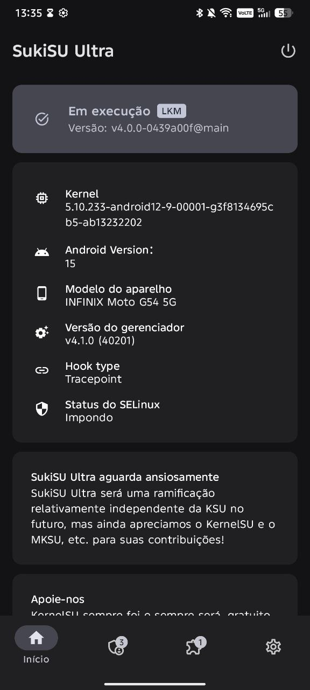
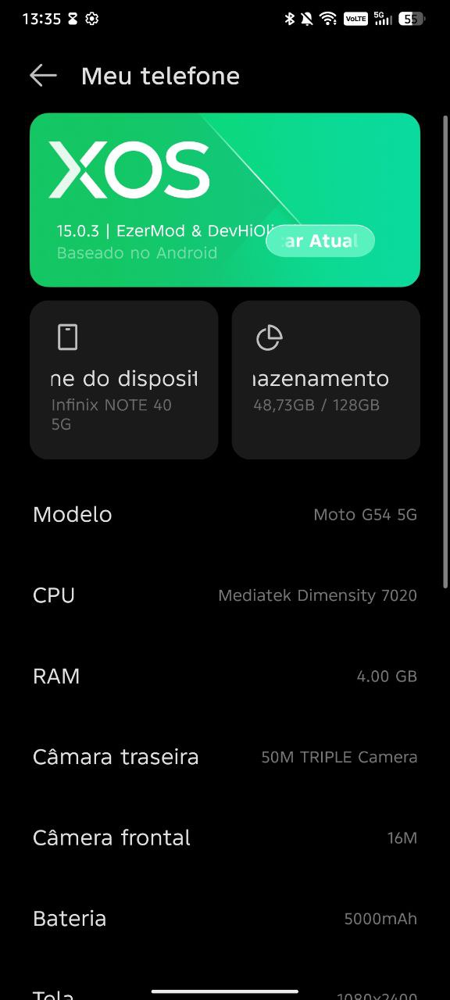

<h1 align="center">📱 XOS 15.0.3.127 Stable – Moto G54 5G - Moto G64 5G</h1>

  

  <b>Firmware Required:</b> V1TDS35H.83-20-5-6 
  <b>Version:</b> 15.0.3.127 EU Stable 
  <b>Base Device:</b> Infinix Note 40 5G 

---

## ✨ Features & Improvements

<b>Click to expand</b>

### ✔ What’s Working
- Fingerprint sensor
- Bluetooth
- Wi-Fi
- SIM card (calls and mobile data)
- Mobile hotspot
- Display brightness control
- Audio (speaker and microphone) 
<b>In short: all core features are fully functional.</b>

### 🚀 Enhancements
- Removed AOD (not needed for IPS panels)
- Added Transsion Flagship (XOS) – credit: @nyello08
- Flagship Animations Enabled – credit: @nyello08
- Preferred Network 4G/5G Enabled – credit: @devhioliveira10 made the changes, and @Not_psyco discovered the solution and helped
- Lockscreen Wallpaper Fixed – credit: @devhioliveira10
- Included OrangeFox (OFOX) – credit: @ussr_1674 (Soviet)
- Removed HBM mode (not needed for IPS panels) - credit: @devhioliveira10
- removed sar support to improve wifi performance – credit: @devhioliveira10

## ✨ Features

- 🧩 System experience preserved as close as possible to the original XOS  
- 🎮 Game Mode with Turbo Mode fully integrated  
- 📦 Extras folder including useful modules and applications  
- 📊 Dynamic Bar support  
- 📷 2K camera recording support  

- 🤖 **Infinix AI Features**
  - **Folax Smart Touch**
  - **Call Assistant** – real-time AI translation, automatic call summaries, and AI call answering
  - **Social Assistant** – two-way translation and call summaries for social scenarios
  - **Writing Assistant** – rewrite text, fix spelling and grammar, generate summaries, and perform research
  - **Recording Summary** – transcribe recordings into text and generate summaries
  - **AI Visual Enhancer** – intelligently enhances low-resolution videos for a clearer viewing experience

- ⚡ Highly optimized system with excellent performance and stability

---

## 🐞 Known Bugs
- DT2W / R2W / ST2W *(Moto side)*

---

## 📥 Installation Guide

<b>Port Flashing</b>

  
### Be on stock firmware V1TDS35H.83-20-5-6 for best compatibility.
Flashing the Port
1. Boot into bootloader
2. Extract port zip
3. If you are on Windows, run flashWindows.bat.  
   If you are on Linux, run flashLinux.sh in the terminal from the same folder as the port.
4. Follow the on-screen preferences and select the desired options:  
   - Install SukiSU Ultra (y/N)  
   - Install custom recovery (y/N)  
   - Format data (y/N)  
6. Wait for the installer to finish and display the completion message.  
Then press any key and enjoy XOS.

---

## 📡 Credits
Huge thanks to all contributors and supporters:

- @G54USERY (EzerMod) – Made the port bootable  
- @devhioliveira10 (DevHiOliveira) – Performed multiple bug fixes and made XOS stable and solid  
- @ussr_1674 (Soviet) – Creator of the OrangeFox custom recovery for the G54/G64  
- @nyello08 – Added Transsion Flagship (XOS) features and enabled flagship animations  

❤️ And to the community that helped make XOS a stable and reliable port.
---

## 💬 Support
For issues, discussions, or reports:
Talk to us at https://t.me/devhioliveirasupport
Secondary support: https://t.me/ezersuporte

---

## 📸 Screenshots

### 🪟 QS panel

  
  

### 🏠 Homescreen & Lockscreen

  
  

### 📶 Security & Network

  
  

### 🎧 Dynamic Bar & Apps

  
  

### 🛠️ SukiSU Ultra & About Device

  
  

---

## 📥 Download

### 🔗 ROM Download (XOS 15.0.3.127 EU Stable)
➡️ **[Click here to download](https://drive.google.com/file/d/1JGXiJdLMYSpT2PejAUpGTVwJX80i9mfM/view?usp=drive_link)**

---
